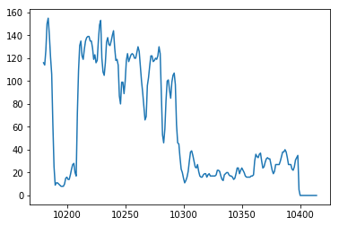

Basic example 
=============

In the example below you can see how to:

* read a LAS file in
* look at the information in the header
* see basic curve information
* make a graph

.. code-block:: ipython

    In [29]: import lasio

    In [30]: las = lasio.read(r"C:\Users\kent\Code\las\examples\2.0\49-005-30258.las")

    In [31]: las.header
    Out[31]: 
    {'Curves': [CurveItem(mnemonic=DEPT, unit=F, value=, descr=1 DEPTH, original_mnemonic=DEPT, data.shape=(235,)),
      CurveItem(mnemonic=DT, unit=US/F, value=, descr=2 SONIC DELTA-T, original_mnemonic=DT, data.shape=(235,)),
      CurveItem(mnemonic=RESD, unit=OHMM, value=, descr=3 DEEP RESISTIVITY, original_mnemonic=RESD, data.shape=(235,)),
      CurveItem(mnemonic=SP, unit=MV, value=, descr=4 SP CURVE, original_mnemonic=SP, data.shape=(235,)),
      CurveItem(mnemonic=GR, unit=GAPI, value=, descr=5 GAMMA RAY, original_mnemonic=GR, data.shape=(235,))],
     'Other': '',
     'Parameter': [HeaderItem(mnemonic=BHT, unit=DEGF, value=194.0, descr=BOTTOM HOLE TEMPERATURE, original_mnemonic=BHT),
      HeaderItem(mnemonic=RMF, unit=OHMM, value=0.441, descr=MUD FILTRATE RESISTIVITY, original_mnemonic=RMF),
      HeaderItem(mnemonic=RMFT, unit=DEGF, value=68.0, descr=MEASURE TEMPERATURE OF RMF, original_mnemonic=RMFT),
      HeaderItem(mnemonic=EKB, unit=F, value=4642.0, descr=ELEVATION KELLY BUSHING, original_mnemonic=EKB),
      HeaderItem(mnemonic=SECT, unit=, value=36, descr=SECTION, original_mnemonic=SECT),
      HeaderItem(mnemonic=TOWN, unit=, value=47N, descr=TOWNSHIP, original_mnemonic=TOWN),
      HeaderItem(mnemonic=RANG, unit=, value=71W, descr=RANGE, original_mnemonic=RANG)],
     'Version': [HeaderItem(mnemonic=VERS, unit=, value=2.0, descr=CWLS log ASCII Standard - Version 2.0, original_mnemonic=VERS),
      HeaderItem(mnemonic=WRAP, unit=, value=NO, descr=One Line per Depth Step, original_mnemonic=WRAP),
      HeaderItem(mnemonic=CREA, unit=, value=02-08-2006, descr=LAS File Creation Date (MM-DD-YYYY), original_mnemonic=CREA)],
     'Well': [HeaderItem(mnemonic=STRT, unit=F, value=10180.0, descr=START DEPTH, original_mnemonic=STRT),
      HeaderItem(mnemonic=STOP, unit=F, value=10414.0, descr=STOP DEPTH, original_mnemonic=STOP),
      HeaderItem(mnemonic=STEP, unit=F, value=1.0, descr=STEP, original_mnemonic=STEP),
      HeaderItem(mnemonic=NULL, unit=, value=-999.25, descr=NULL VALUE, original_mnemonic=NULL),
      HeaderItem(mnemonic=COMP, unit=, value=Cramer Oil, descr=COMPANY, original_mnemonic=COMP),
      HeaderItem(mnemonic=WELL, unit=, value=#36-16 State, descr=WELL, original_mnemonic=WELL),
      HeaderItem(mnemonic=LOC, unit=, value=SE SE 36-47N-71W, descr=LOCATION, original_mnemonic=LOC),
      HeaderItem(mnemonic=CNTY, unit=, value=Campbell, descr=COUNTY, original_mnemonic=CNTY),
      HeaderItem(mnemonic=FLD, unit=, value=, descr=FIELD, original_mnemonic=FLD),
      HeaderItem(mnemonic=STAT, unit=, value=Wyoming, descr=STATE, original_mnemonic=STAT),
      HeaderItem(mnemonic=CTRY, unit=, value=U.S.A., descr=COUNTRY, original_mnemonic=CTRY),
      HeaderItem(mnemonic=DATE, unit=, value=11/91, descr=COMPLETION DATE (MM/YY), original_mnemonic=DATE),
      HeaderItem(mnemonic=API, unit=, value=49-005-30258-0000, descr=API NUMBER, original_mnemonic=API),
      HeaderItem(mnemonic=SRVC, unit=, value=, descr=SERVICE COMPANY, original_mnemonic=SRVC)]}

    In [33]: type(las.data)
    Out[33]: numpy.ndarray

    In [34]: las.data.shape
    Out[34]: (235, 5)

    In [35]: for curve in las.curves:
        ...:     print(curve.mnemonic)
        ...:     print(curve.unit)
        ...:     print(curve.data)
        ...:     print("\n")
        ...:     
    DEPT
    F
    [ 10180.  10181.  10182.  10183.  10184.  10185.  10186.  10187.  10188.
      10189.  10190.  10191.  10192.  10193.  10194.  10195.  10196.  10197.
      10198.  10199.  10200.  10201.  10202.  10203.  10204.  10205.  10206.
      10207.  10208.  10209.  10210.  10211.  10212.  10213.  10214.  10215.
      10216.  10217.  10218.  10219.  10220.  10221.  10222.  10223.  10224.
      10225.  10226.  10227.  10228.  10229.  10230.  10231.  10232.  10233.
      10234.  10235.  10236.  10237.  10238.  10239.  10240.  10241.  10242.
      10243.  10244.  10245.  10246.  10247.  10248.  10249.  10250.  10251.
      10252.  10253.  10254.  10255.  10256.  10257.  10258.  10259.  10260.
      10261.  10262.  10263.  10264.  10265.  10266.  10267.  10268.  10269.
      10270.  10271.  10272.  10273.  10274.  10275.  10276.  10277.  10278.
      10279.  10280.  10281.  10282.  10283.  10284.  10285.  10286.  10287.
      10288.  10289.  10290.  10291.  10292.  10293.  10294.  10295.  10296.
      10297.  10298.  10299.  10300.  10301.  10302.  10303.  10304.  10305.
      10306.  10307.  10308.  10309.  10310.  10311.  10312.  10313.  10314.
      10315.  10316.  10317.  10318.  10319.  10320.  10321.  10322.  10323.
      10324.  10325.  10326.  10327.  10328.  10329.  10330.  10331.  10332.
      10333.  10334.  10335.  10336.  10337.  10338.  10339.  10340.  10341.
      10342.  10343.  10344.  10345.  10346.  10347.  10348.  10349.  10350.
      10351.  10352.  10353.  10354.  10355.  10356.  10357.  10358.  10359.
      10360.  10361.  10362.  10363.  10364.  10365.  10366.  10367.  10368.
      10369.  10370.  10371.  10372.  10373.  10374.  10375.  10376.  10377.
      10378.  10379.  10380.  10381.  10382.  10383.  10384.  10385.  10386.
      10387.  10388.  10389.  10390.  10391.  10392.  10393.  10394.  10395.
      10396.  10397.  10398.  10399.  10400.  10401.  10402.  10403.  10404.
      10405.  10406.  10407.  10408.  10409.  10410.  10411.  10412.  10413.
      10414.]

    DT
    US/F
    [ 59.9  59.9  60.5  63.5  64.5  64.6  61.5  59.2  55.9  52.1  49.1  47.8
      47.2  47.2  48.5  49.6  48.3  46.9  46.6  46.8  46.7  47.8  51.2  51.6
      51.1  51.4  52.3  52.3  51.5  51.2  53.3  57.6  60.6  60.8  59.5  59.7
      61.1  61.6  61.8  62.   62.2  62.2  62.2  60.9  60.8  61.5  61.4  61.9
      63.2  64.4  62.6  61.4  61.   61.1  62.8  65.4  66.3  66.2  68.3  69.8
      70.6  72.4  74.2  74.3  71.5  63.5  60.1  65.2  68.2  66.4  63.2  63.4
      65.3  65.1  64.1  63.9  63.9  63.9  63.9  63.5  62.7  63.1  63.6  61.1
      58.4  58.1  58.1  57.7  57.1  56.6  56.8  59.5  61.3  61.9  61.9  62.1
      62.5  62.5  62.5  62.4  62.   60.7  57.5  56.   56.   57.8  60.   60.3
      60.2  59.9  60.4  60.9  61.4  61.4  56.1  51.2  48.4  48.5  49.8  49.8
      50.   50.9  50.5  47.9  46.3  46.1  46.4  46.4  45.8  45.9  46.5  46.7
      47.3  51.9  55.7  61.2  66.5  68.9  69.6  69.6  69.1  68.   66.9  66.7
      66.6  66.   65.   64.4  64.   64.6  64.7  64.4  64.4  65.5  67.4  69.3
      70.9  72.4  73.3  73.7  73.8  73.4  73.4  74.4  75.4  75.2  72.6  71.6
      72.   74.3  74.6  74.7  72.3  71.9  75.5  77.6  78.3  75.8  73.8  71.6
      69.3  67.1  65.   64.   63.8  63.9  65.1  65.5  64.3  64.4  66.   66.
      64.6  64.9  65.   62.6  60.4  59.3  59.3  62.6  63.6  61.5  61.7  62.3
      61.9  62.3  63.2  63.5  63.5  62.7  60.   57.   54.   49.1  47.2  46.7
      47.1  47.6  48.8  49.8  50.8  51.1  50.2  49.   48.4  50.6  50.7  50.4
      49.9  49.7  49.6  51.5  52.5  53.2  54.1]

    RESD
    OHMM
    [  2.20000000e+01   2.10000000e+01   1.97000000e+01   1.89000000e+01
       1.82000000e+01   1.80000000e+01   1.80000000e+01   2.10000000e+01
       2.90000000e+01   5.30000000e+01   3.90000000e+02   1.50100000e+03
       2.09300000e+03   1.67700000e+03   1.07700000e+03   7.65000000e+02
       5.64000000e+02   5.54000000e+02   4.87000000e+02   1.59000000e+02
       7.40000000e+01   5.70000000e+01   5.00000000e+01   4.80000000e+01
       4.80000000e+01   4.90000000e+01   5.60000000e+01   5.90000000e+01
       6.10000000e+01   5.20000000e+01   2.40000000e+01   1.75000000e+01
       1.54000000e+01   1.52000000e+01   1.52000000e+01   1.52000000e+01
       1.47000000e+01   1.29000000e+01   1.20000000e+01   1.10000000e+01
       1.06000000e+01   1.05000000e+01   1.05000000e+01   1.08000000e+01
       1.11000000e+01   1.12000000e+01   1.07000000e+01   9.90000000e+00
       9.30000000e+00   9.00000000e+00   9.40000000e+00   1.01000000e+01
       1.02000000e+01   1.00000000e+01   8.00000000e+00   7.10000000e+00
       6.50000000e+00   5.80000000e+00   5.00000000e+00   4.20000000e+00
       3.60000000e+00   3.30000000e+00   3.20000000e+00   3.30000000e+00
       4.00000000e+00   4.90000000e+00   5.40000000e+00   5.80000000e+00
       6.20000000e+00   6.60000000e+00   7.60000000e+00   8.90000000e+00
       1.01000000e+01   1.12000000e+01   1.24000000e+01   1.51000000e+01
       1.66000000e+01   1.75000000e+01   1.80000000e+01   1.80000000e+01
       1.80000000e+01   1.80000000e+01   1.90000000e+01   2.10000000e+01
       2.30000000e+01   2.70000000e+01   3.00000000e+01   3.30000000e+01
       3.50000000e+01   3.50000000e+01   3.00000000e+01   2.70000000e+01
       2.30000000e+01   1.99000000e+01   1.89000000e+01   1.85000000e+01
       1.94000000e+01   2.00000000e+01   2.00000000e+01   2.20000000e+01
       2.40000000e+01   2.60000000e+01   3.00000000e+01   3.30000000e+01
       3.40000000e+01   3.00000000e+01   2.80000000e+01   2.60000000e+01
       2.60000000e+01   2.90000000e+01   3.40000000e+01   3.50000000e+01
       3.90000000e+01   4.40000000e+01   6.60000000e+01   1.22000000e+02
       2.48000000e+02   1.72400000e+03   2.03600000e+03   2.03600000e+03
       2.05500000e+03   2.09300000e+03   2.11300000e+03   2.11300000e+03
       2.11300000e+03   2.09300000e+03   1.63100000e+03   7.51000000e+02
       2.50000000e+02   2.16000000e+02   1.99000000e+02   1.76000000e+02
       1.30000000e+02   9.50000000e+01   6.90000000e+01   4.70000000e+01
       3.10000000e+01   2.10000000e+01   1.75000000e+01   1.61000000e+01
       1.61000000e+01   1.61000000e+01   1.75000000e+01   1.80000000e+01
       1.83000000e+01   1.83000000e+01   1.83000000e+01   1.83000000e+01
       1.82000000e+01   1.74000000e+01   1.63000000e+01   1.54000000e+01
       1.40000000e+01   1.27000000e+01   1.10000000e+01   9.00000000e+00
       7.50000000e+00   6.70000000e+00   6.10000000e+00   5.70000000e+00
       5.60000000e+00   5.30000000e+00   5.00000000e+00   4.50000000e+00
       4.00000000e+00   3.50000000e+00   3.20000000e+00   2.80000000e+00
       2.50000000e+00   2.20000000e+00   1.94000000e+00   1.72000000e+00
       1.59000000e+00   1.50000000e+00   1.43000000e+00   1.37000000e+00
       1.34000000e+00   1.34000000e+00   1.38000000e+00   1.59000000e+00
       2.00000000e+00   2.90000000e+00   3.30000000e+00   3.80000000e+00
       4.50000000e+00   5.00000000e+00   5.30000000e+00   5.50000000e+00
       5.60000000e+00   5.60000000e+00   5.70000000e+00   5.70000000e+00
       5.70000000e+00   5.70000000e+00   5.80000000e+00   6.30000000e+00
       7.20000000e+00   8.10000000e+00   8.30000000e+00   8.30000000e+00
       8.10000000e+00   8.00000000e+00   8.80000000e+00   1.00000000e+01
       1.01000000e+01   9.20000000e+00   8.60000000e+00   8.50000000e+00
       9.40000000e+00   1.14000000e+01   1.48000000e+01   1.90000000e+01
       4.00000000e+01   8.90000000e+01   1.34000000e+02   2.20000000e+02
       1.93000000e+02   1.22000000e+02   9.60000000e+01   8.10000000e+01
       7.50000000e+01   7.50000000e+01   9.70000000e+01   1.67000000e+02
       3.15000000e+02   1.69300000e+03   1.87400000e+03   1.87400000e+03
       1.87400000e+03   5.91000000e+02   2.08000000e+02   1.34000000e+02
       1.16000000e+02   1.13000000e+02   1.56000000e+02]

    SP
    MV
    [  45.6   49.    53.    55.6   58.4   62.5   64.7   66.9   69.3   71.3
       73.7   75.7   76.7   77.1   77.5   77.5   77.5   77.5   77.1   76.5
       75.9   74.7   73.7   71.1   67.3   63.7   60.6   57.8   53.2   48.2
       42.9   37.9   34.5   31.7   30.1   28.5   27.2   26.    24.4   23.4
       22.2   21.2   20.8   20.2   19.8   19.2   19.    19.    18.8   18.6
       18.4   18.2   18.2   18.2   18.2   18.2   18.8   19.4   20.4   21.6
       22.4   23.8   25.    26.4   28.    29.3   30.5   31.3   32.7   33.5
       34.3   34.9   35.7   36.1   36.1   36.3   36.3   36.3   36.3   36.3
       36.3   36.3   36.3   36.3   36.9   37.9   38.5   39.7   40.1   40.5
       40.5   40.7   40.9   40.9   41.1   41.1   41.1   41.3   41.7   42.1
       42.9   43.9   44.7   45.6   46.6   47.2   48.    48.6   50.2   51.2
       52.8   54.2   55.2   56.    57.2   58.    59.    59.6   60.8   62.3
       63.5   64.7   66.3   67.7   68.9   70.7   72.1   73.1   74.5   75.9
       77.3   78.8   80.8   83.4   85.4   87.6   89.8   91.4   93.4   94.2
       95.1   95.5   95.5   95.5   95.5   95.7   96.5   96.7   96.9   97.1
       97.1   96.7   95.9   95.1   94.8   94.8   94.8   94.8   95.5   96.3
       97.1   98.1   99.1   99.5   99.9  100.1  100.1  100.1   99.9   99.9
      100.1  101.9  102.1  103.9  104.9  105.7  106.1  106.3  106.5  106.5
      106.5  106.5  106.5  105.9  105.3  104.7  104.7  104.5  104.5  104.5
      104.5  104.7  105.9  106.9  109.1  109.7  108.7  107.9  107.3  106.9
      106.7  106.7  106.5  105.9  105.1  102.7   87.6   78.8   76.5   76.5
       76.5   76.5   76.5   76.5   75.5   74.1   72.1   70.5   68.9   67.5
       66.7   65.7   65.1   64.1   63.3   63.1   62.7   62.5   62.5   62.5
       62.5   62.5   62.9   64.3   65.9]

    GR
    GAPI
    [ 116.  114.  127.  150.  155.  140.  121.  106.   62.   25.    9.   11.
       11.   10.    9.    8.    8.    8.   10.   15.   16.   14.   14.   18.
       23.   27.   28.   20.   17.   72.  109.  131.  135.  122.  119.  128.
      135.  138.  139.  139.  135.  135.  129.  119.  123.  116.  118.  135.
      149.  153.  120.  108.  105.  116.  134.  138.  132.  131.  135.  140.
      144.  129.  118.  119.  114.   87.   80.   99.   99.   89.  100.  118.
      124.  117.  120.  123.  124.  123.  120.  120.  125.  130.  126.  113.
      100.   90.   78.   66.   69.   96.  103.  113.  122.  122.  117.  118.
      120.  119.  122.  130.  124.   87.   53.   46.   58.   83.  100.  101.
       92.   85.   99.  105.  107.   97.   62.   46.   45.   33.   23.   20.
       15.   11.   13.   16.   21.   30.   38.   39.   35.   30.   25.   24.
       27.   21.   17.   16.   16.   18.   19.   19.   16.   18.   19.   17.
       17.   17.   17.   17.   18.   22.   22.   21.   17.   14.   13.   18.
       19.   20.   20.   18.   17.   17.   16.   14.   15.   19.   24.   24.
       19.   22.   24.   22.   20.   17.   16.   16.   16.   16.   17.   17.
       18.   30.   36.   34.   33.   36.   37.   30.   24.   25.   29.   32.
       33.   32.   32.   27.   22.   19.   21.   27.   27.   27.   27.   30.
       34.   38.   38.   40.   38.   33.   27.   27.   27.   23.   22.   25.
       31.   33.   35.    5.    0.    0.    0.    0.    0.    0.    0.    0.
        0.    0.    0.    0.    0.    0.    0.]

    In [36]: import matplotlib.pyplot as plt

    In [37]: %matplotlib inline

    In [38]: plt.plot(las.index, las["GR"])
    Out[38]: [<matplotlib.lines.Line2D at 0xb9dc1d0>]

