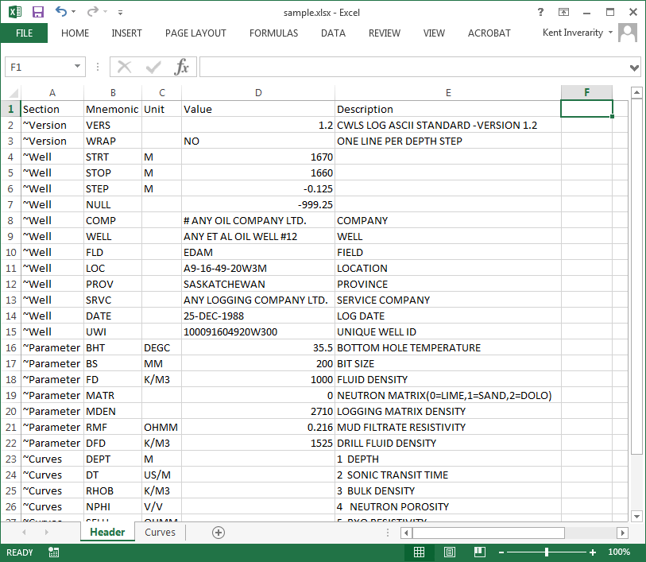
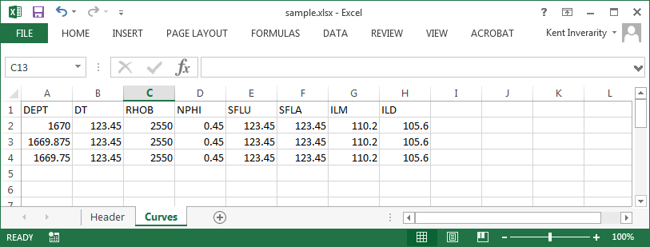

Exporting LAS files to Excel
============================

You can easily convert LAS files into Excel, retaining the header information.

There are two scripts:

1. ``las2excel`` - very simple conversion of one file
2. ``las2excelbulk`` - with options for pattern matching and recursing into subfolders.

Basic example
-------------

For a simple `example LAS file <https://raw.githubusercontent.com/kinverarity1/lasio/master/tests/examples/sample.las>`__:

.. code-block:: doscon

    (py36) C:\Program Files (x86)\Misc\kentcode\lasio>las2excel --help
    usage: Convert LAS file to XLSX [-h] LAS_filename XLSX_filename

    positional arguments:
      LAS_filename
      XLSX_filename

    optional arguments:
      -h, --help     show this help message and exit

    (py36) C:\Program Files (x86)\Misc\kentcode\lasio>las2excel tests\examples\sample.las c:\users\kinverarity\Desktop\sample.xlsx

The spreadsheet written to disk has two sheets named "Header" and "Curves". The "Header" sheet
has five columns named "Section", "Mnemonic", "Unit", "Value", and "Description", containing
the information from all the sections in the header.

The "Curves" sheet contains the data as a table, with the curve mnemonics as a header row.

Multiple files (``las2excelbulk``)
----------------------------------

The better script to use is ``las2excelbulk``:

.. code-block:: doscon

    (py36) C:\Windows\System32>las2excelbulk --help
    usage: Convert LAS files to XLSX [-h] [-g GLOB] [-r] [-i] path

    positional arguments:
      path

    optional arguments:
      -h, --help            show this help message and exit
      -g GLOB, --glob GLOB  Match LAS files with this pattern (default: *.las)
      -r, --recursive       Recurse through subfolders. (default: False)
      -i, --ignore-header-errors
                            Ignore header section errors. (default: False)

Here is the command to create Excel versions of all the LAS files contained within the folder
``test_folder``, and any sub-folders:

.. code-block:: doscon

    (py36) C:\Users\kinverarity\Documents\scratch2017\November>las2excelbulk --recursive test_folder
    Converting test_folder\-2793 & -2746\5086\PN41497.LAS -> test_folder\-2793 & -2746\5086\pn41497.xlsx
    Converting test_folder\-2793 & -2746\5149\PN41497.LAS -> test_folder\-2793 & -2746\5149\pn41497.xlsx
    Converting test_folder\-2794\6356\66302794.las -> test_folder\-2794\6356\66302794.xlsx
    Converting test_folder\-2794\6808\66302794.las -> test_folder\-2794\6808\66302794.xlsx
    Converting test_folder\-2794\7608\2794HYD.LAS -> test_folder\-2794\7608\2794hyd.xlsx
    Converting test_folder\-2794\7608\66302794.LAS -> test_folder\-2794\7608\66302794.xlsx
    Failed to convert file. Error message:
    Traceback (most recent call last):
      File "c:\program files (x86)\misc\kentcode\lasio\lasio\excel.py", line 133, in main_bulk
        l = las.LASFile(lasfn)
      File "c:\program files (x86)\misc\kentcode\lasio\lasio\las.py", line 77, in __init__
        self.read(file_ref, **read_kwargs)
      File "c:\program files (x86)\misc\kentcode\lasio\lasio\las.py", line 204, in read
        data = np.reshape(arr, (-1, n_arr_cols))
      File "C:\Program Files (x86)\Miniconda3\envs\py36\lib\site-packages\numpy\core\fromnumeric.py", line 232, in reshape
        return _wrapfunc(a, 'reshape', newshape, order=order)
      File "C:\Program Files (x86)\Miniconda3\envs\py36\lib\site-packages\numpy\core\fromnumeric.py", line 57, in _wrapfunc
        return getattr(obj, method)(*args, **kwds)
    ValueError: cannot reshape array of size 25708 into shape (11)

    Converting test_folder\-2794\7627\clr105.las -> test_folder\-2794\7627\clr105.xlsx
    Converting test_folder\-2839 &c\4830\PN36385.LAS -> test_folder\-2839 &c\4830\pn36385.xlsx
    Converting test_folder\-2874\6375\66302874.las -> test_folder\-2874\6375\66302874.xlsx
    Converting test_folder\-2874\7607\2874HYD.LAS -> test_folder\-2874\7607\2874hyd.xlsx
    Converting test_folder\-2874\7607\66302874.LAS -> test_folder\-2874\7607\66302874.xlsx
    Failed to convert file. Error message:
    Traceback (most recent call last):
      File "c:\program files (x86)\misc\kentcode\lasio\lasio\excel.py", line 133, in main_bulk
        l = las.LASFile(lasfn)
      File "c:\program files (x86)\misc\kentcode\lasio\lasio\las.py", line 77, in __init__
        self.read(file_ref, **read_kwargs)
      File "c:\program files (x86)\misc\kentcode\lasio\lasio\las.py", line 204, in read
        data = np.reshape(arr, (-1, n_arr_cols))
      File "C:\Program Files (x86)\Miniconda3\envs\py36\lib\site-packages\numpy\core\fromnumeric.py", line 232, in reshape
        return _wrapfunc(a, 'reshape', newshape, order=order)
      File "C:\Program Files (x86)\Miniconda3\envs\py36\lib\site-packages\numpy\core\fromnumeric.py", line 57, in _wrapfunc
        return getattr(obj, method)(*args, **kwds)
    ValueError: cannot reshape array of size 31666 into shape (16)

    Converting test_folder\-2874\7626\clr121.las -> test_folder\-2874\7626\clr121.xlsx
    Converting test_folder\-2875\5220\1cm\PN44456.LAS -> test_folder\-2875\5220\1cm\pn44456.xlsx
    Converting test_folder\-2875\5220\5cm\PN44456.LAS -> test_folder\-2875\5220\5cm\pn44456.xlsx
    Converting test_folder\-2875\5220\980402\PN44456.LAS -> test_folder\-2875\5220\980402\pn44456.xlsx
    Converting test_folder\-2875\5220\980403_0\PN44456.LAS -> test_folder\-2875\5220\980403_0\pn44456.xlsx
    Converting test_folder\-2875\5220\980403_1\PN44456.LAS -> test_folder\-2875\5220\980403_1\pn44456.xlsx
    Converting test_folder\-2875\5220\cal1cm\PN44456.LAS -> test_folder\-2875\5220\cal1cm\pn44456.xlsx
    Converting test_folder\-2875\5220\cal5cm\PN44456.LAS -> test_folder\-2875\5220\cal5cm\pn44456.xlsx
    Converting test_folder\-2875\5220\tm2\PN44456.LAS -> test_folder\-2875\5220\tm2\pn44456.xlsx
    Converting test_folder\-2875\6813\2875HYD.LAS -> test_folder\-2875\6813\2875hyd.xlsx
    Header section Parameter regexp=~P was not found.
    Converting test_folder\-2875\6813\66302875.LAS -> test_folder\-2875\6813\66302875.xlsx
    Converting test_folder\-2876\5219\PN44457.LAS -> test_folder\-2876\5219\pn44457.xlsx
    Converting test_folder\-2876\5219\PN44457H.LAS -> test_folder\-2876\5219\pn44457h.xlsx
    Converting test_folder\-2876\5219\PN44457I.LAS -> test_folder\-2876\5219\pn44457i.xlsx
    Converting test_folder\-2876\7609\2876H.LAS -> test_folder\-2876\7609\2876h.xlsx
    Converting test_folder\-2876\7609\66302876.LAS -> test_folder\-2876\7609\66302876.xlsx
    Failed to convert file. Error message:
    Traceback (most recent call last):
      File "c:\program files (x86)\misc\kentcode\lasio\lasio\excel.py", line 133, in main_bulk
        l = las.LASFile(lasfn)
      File "c:\program files (x86)\misc\kentcode\lasio\lasio\las.py", line 77, in __init__
        self.read(file_ref, **read_kwargs)
      File "c:\program files (x86)\misc\kentcode\lasio\lasio\las.py", line 204, in read
        data = np.reshape(arr, (-1, n_arr_cols))
      File "C:\Program Files (x86)\Miniconda3\envs\py36\lib\site-packages\numpy\core\fromnumeric.py", line 232, in reshape
        return _wrapfunc(a, 'reshape', newshape, order=order)
      File "C:\Program Files (x86)\Miniconda3\envs\py36\lib\site-packages\numpy\core\fromnumeric.py", line 57, in _wrapfunc
        return getattr(obj, method)(*args, **kwds)
    ValueError: cannot reshape array of size 19791 into shape (11)

    Converting test_folder\-2876\7629\clr120.las -> test_folder\-2876\7629\clr120.xlsx
    Converting test_folder\-2877\7597\CLR118.LAS -> test_folder\-2877\7597\clr118.xlsx
    Converting test_folder\-2877\7628\clr118.las -> test_folder\-2877\7628\clr118.xlsx
    Converting test_folder\-3066\6372\66303066.las -> test_folder\-3066\6372\66303066.xlsx
    Converting test_folder\-3066\6810\3066HYD.LAS -> test_folder\-3066\6810\3066hyd.xlsx
    Converting test_folder\-3066\6810\66303066.LAS -> test_folder\-3066\6810\66303066.xlsx
    Converting test_folder\-3067\6373\66303067.las -> test_folder\-3067\6373\66303067.xlsx
    Converting test_folder\-3067\6811\3067HYD.LAS -> test_folder\-3067\6811\3067hyd.xlsx
    Converting test_folder\-3067\6811\66303067.LAS -> test_folder\-3067\6811\66303067.xlsx
    Header section Parameter regexp=~P was not found.
    Converting test_folder\-3068\6374\66303068.las -> test_folder\-3068\6374\66303068.xlsx
    Converting test_folder\-3068\6812\3068HYD.LAS -> test_folder\-3068\6812\3068hyd.xlsx
    Converting test_folder\-3068\6812\66303068.LAS -> test_folder\-3068\6812\66303068.xlsx

Notice that some LAS files raised exceptions (in this case, ``ValueError``) and were not converted. In some cases these will relate to errors in the header sections:

.. code-block:: doscon

    (py36) Q:\>las2excelbulk.exe -r .
    Converting .\4424\PN31769.LAS -> .\4424\pn31769.xlsx
    Converting .\4424\PN31769L.LAS -> .\4424\pn31769l.xlsx
    Converting .\4424\PN31769R.LAS -> .\4424\pn31769r.xlsx
    Converting .\4428\pn31769.las -> .\4428\pn31769.xlsx
    Failed to convert file. Error message:
    Traceback (most recent call last):
      File "c:\program files (x86)\misc\kentcode\lasio\lasio\reader.py", line 366, in parse_header_section
        values = read_line(line)
      File "c:\program files (x86)\misc\kentcode\lasio\lasio\reader.py", line 522, in read_line
        return read_header_line(*args, **kwargs)
      File "c:\program files (x86)\misc\kentcode\lasio\lasio\reader.py", line 548, in read_header_line
        mdict = m.groupdict()
    AttributeError: 'NoneType' object has no attribute 'groupdict'

    During handling of the above exception, another exception occurred:

    Traceback (most recent call last):
      File "c:\program files (x86)\misc\kentcode\lasio\lasio\excel.py", line 133, in main_bulk
        l = las.LASFile(lasfn, ignore_header_errors=args.ignore_header_errors)
      File "c:\program files (x86)\misc\kentcode\lasio\lasio\las.py", line 77, in __init__
        self.read(file_ref, **read_kwargs)
      File "c:\program files (x86)\misc\kentcode\lasio\lasio\las.py", line 156, in read
        ignore_header_errors=ignore_header_errors)
      File "c:\program files (x86)\misc\kentcode\lasio\lasio\las.py", line 110, in add_section
        **sect_kws)
      File "c:\program files (x86)\misc\kentcode\lasio\lasio\reader.py", line 375, in parse_header_section
        raise exceptions.LASHeaderError(message)
    lasio.exceptions.LASHeaderError: Line #21 - failed in ~Well Information section on line:
    PN        PERMIT NUMBER: 31769AttributeError: 'NoneType' object has no attribute 'groupdict'

    Converting .\4526\PENRICE.LAS -> .\4526\penrice.xlsx

But in this case I'm happy to lose that single corrupted line in the header in the conversion. In order to force lasio to ignore the error and continue to convert the file, use the ``--ignore-header-errors`` flag (``-i`` for short):

.. code-block:: doscon

    (py36) Q:\>las2excelbulk.exe -r -i .
    Converting .\4424\PN31769.LAS -> .\4424\pn31769.xlsx
    Converting .\4424\PN31769L.LAS -> .\4424\pn31769l.xlsx
    Converting .\4424\PN31769R.LAS -> .\4424\pn31769r.xlsx
    Converting .\4428\pn31769.las -> .\4428\pn31769.xlsx
    Line #21 - failed in ~Well Information section on line:
    PN        PERMIT NUMBER: 31769AttributeError: 'NoneType' object has no attribute 'groupdict'
    Converting .\4526\PENRICE.LAS -> .\4526\penrice.xlsx

lasio still reports the problem, but ignores it and continues the conversion of the file.
